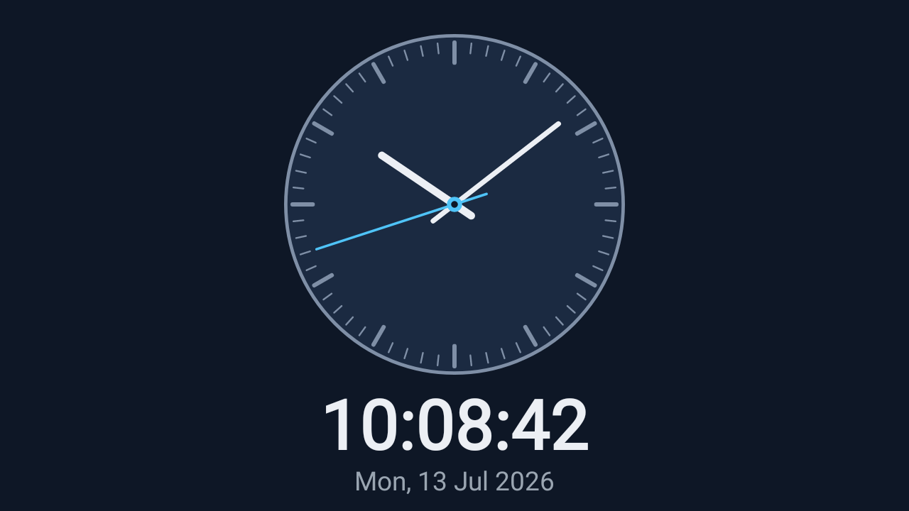

# TX10 Clock

After an approved GitHub Release is installed, TX10 Pro boots into an elegant
analog + digital clock, stays stable, and shows the correct local time/date.

Project: `BeFeast/tx10-clock`.



This image is a **non-binding test-harness fixture**. It proves deterministic
offscreen rendering and pixel-diff diagnostics; it is not the accepted product
visual contract. The production layout is implemented only from the separately
operator-approved visual package.

## What this is

A minimal, MIT-licensed Android TV app:

- **Pure Java + Android `Canvas`.** No NDK, no native libraries — the packaged
  APK is ABI-neutral (DEX + resources only) and therefore installs and runs on
  the TX10's 32-bit `armeabi-v7a` runtime.
- **Package id** `com.befeast.tx10clock`, **min/target/compile SDK 29**.
- **Leanback launcher** entry so it appears as a first-class Android TV app,
  plus a standard launcher entry for development on phones/tablets.

The renderer ([`ClockRenderer`](app/src/main/java/com/befeast/tx10clock/ClockRenderer.java))
is a pure function of a [`ClockConfig`](app/src/main/java/com/befeast/tx10clock/ClockConfig.java),
a frame size, and a timestamp from an injectable
[`TimeSource`](app/src/main/java/com/befeast/tx10clock/TimeSource.java). That
purity is what makes the golden test deterministic.

## Configuration & runtime status

The app is driven by a small, **renderer-agnostic** external configuration file
(`getExternalFilesDir()/config.json`, no storage permission) and publishes a
verifier-safe `status.json`. Ingestion is strict and bounded (oversized,
malformed, duplicate-key, unknown-key, and out-of-range documents are rejected)
with a last-known-good copy that keeps a running clock alive across a bad edit.
The full contract — accepted schema, the same-directory temp-file + atomic-rename
update protocol, `status.json` shape, and boot behaviour — is documented in
[`docs/external-config.md`](docs/external-config.md).

The configuration core
([`ExternalConfig`](app/src/main/java/com/befeast/tx10clock/ExternalConfig.java),
[`Json`](app/src/main/java/com/befeast/tx10clock/Json.java),
[`ConfigStore`](app/src/main/java/com/befeast/tx10clock/ConfigStore.java)) has
**no Android dependency**, so its strict-ingestion, last-known-good, reload,
atomic-replacement, and status behaviours run deterministically under a plain
JVM — see the offline test path below. The settings it carries are behavioural
only and encode no visual decisions.

## Requirements

- JDK 17
- Android SDK with `platforms;android-29` and `build-tools;29.0.3`
  (point Gradle at it via `ANDROID_SDK_ROOT` or a `local.properties`
  `sdk.dir=` line — `local.properties` is intentionally untracked).

## Build & test

```bash
./gradlew assembleRelease        # build the release APK
./gradlew lint test              # Android Lint + unit/static/golden/config checks
```

The strict-ingestion, last-known-good, reload, atomic-replacement, and
`status.json` checks for the Android-free configuration core can also be run
**offline, without the Android SDK**, with a plain JDK 17 + JUnit:

```bash
scripts/run-config-jvm-tests.sh   # compiles + runs the config-core tests only
```

The scaffold's `assembleRelease` output is unsigned. CI may retain it under the
explicit name `tx10-clock-unsigned-ci-verification-apk` for manifest and package
inspection only; it is not installable and must not be attached to a GitHub
Release. Release signing and the installable APK are delivered by issue
[#5](https://github.com/BeFeast/tx10-clock/issues/5).

The unit suite includes a **deterministic offscreen golden harness**
([`ClockRendererRenderTest`](app/src/test/java/com/befeast/tx10clock/ClockRendererRenderTest.java)):
under Robolectric with `graphicsMode=NATIVE` in the declared API 29 environment,
the production renderer draws a fixed clock/config into a `1280x720`
`ARGB_8888` bitmap and the frame is compared against the committed golden PNG.
On a mismatch it writes `actual`, `expected`, and `diff` images to
`app/build/golden-output/`.

Regenerate the golden after an intentional visual change:

```bash
./gradlew test -Dgolden.record=true    # rewrites app/src/test/resources/golden/, then commit it
```

## Outcome verification

[`scripts/verify-outcome.sh`](scripts/verify-outcome.sh) is the stable
post-merge outcome entrypoint. From a clean checkout it runs the full documented
outcome checks and exits non-zero if any fails:

```bash
scripts/verify-outcome.sh
```

It performs: clean build, Android Lint, the unit/static scene/format/config
checks, the offscreen golden verifier, an APK manifest/package inspection
(package id, `versionName` `0.1.0`, SDK 29, **no `lib/**` native entries**), and
the public-path hygiene scan.

## Management Home

Product-management and planning context lives in the operator's synced Obsidian
vault at `Dev/Areas/tx10-clock`. Executable requirements are the assigned
GitHub issues and the approved in-repo documentation only.

## License

[MIT](LICENSE).
